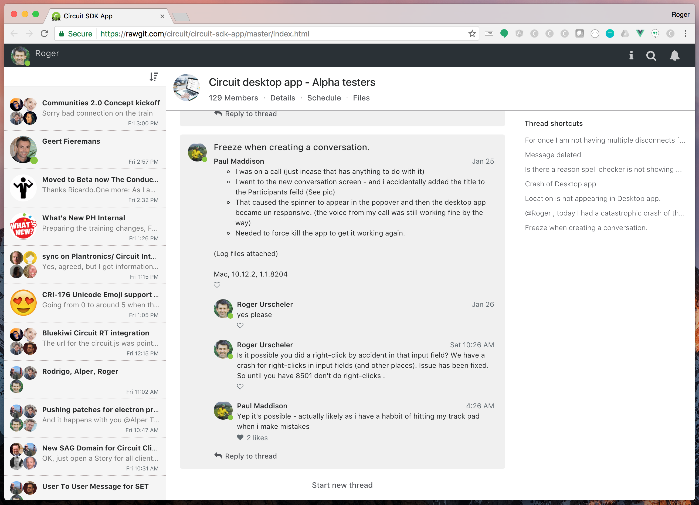

# Circuit-like app built with vue.js and Circuit JS SDK
Circuit-like app built with vue.js and [Circuit JS SDK](https://circuit.github.io/jssdk.html). Showcases several different JS SDK APIs. RTC APIs still to be added.

Live at https://rawgit.com/circuit/circuit-sdk-app/master/index.html

## Getting Started ##

```bash
    git clone https://github.com/circuit/circuit-sdk-app.git
    cd circuit-sdk-app
    npm install
    npm install -g http-server
    http-server
```





